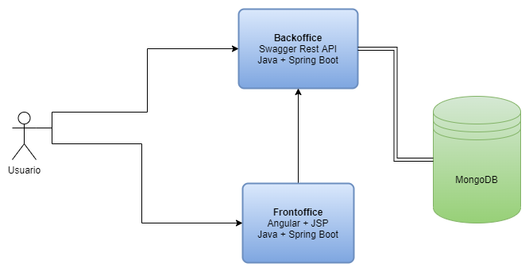

# Walmart Challenge

This project was made in response to the challenge sent by Walmart. 

It consists on two modules:

###Swagger API from Backend:

This development was created using spring boot + swagger to provide services that allow to search products by id, brand and description and apply 50% discount is the seach phrase is a palindrome.

###Angular + JSP Frontoffice:

This development was created using spring boot + jsp in order to provide a graphic interface to search products from swagger API.

### Solution Diagram



### Installation & Deployment

To run the app using docker compose:

```sh
$ docker-compose up
```


### Removal

To remove the app using docker compose:

```sh
$ docker-compose rm
```

To run frontoffice test:

```sh
$ cd walmartfo
$ make frontoffice-run-test
```

To run api test:

```sh
$ cd walmartapi
$ make walmartapi-run-test
```

### Swagger UI URL

If you want to make tests or see the API documents, go to the following URL:

http://localhost:8081/swagger-ui/index.html


### Frontoffice URL

If you want to make use the frontoffice, go to the following URL:

http://localhost:8082/
